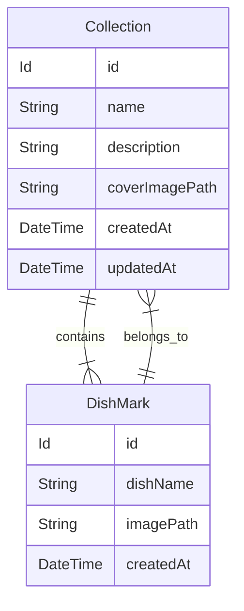
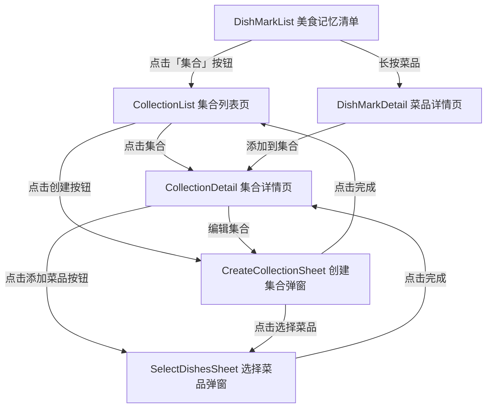
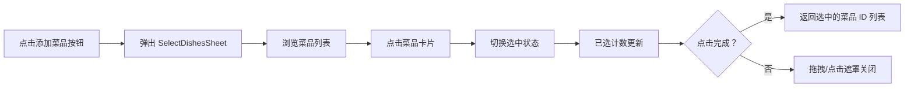

# DishMark Collection 功能实现计划

## 概述

Collection 功能允许用户将多个 DishMark 条目组织成自定义集合，便于分类管理和快速访问。本文档详细描述了数据模型、数据库修改、页面结构、UI/UX 设计和实现顺序。

---

## 1. 数据模型设计

### 1.1 Collection 模型定义

```dart
// lib/data/collection.dart
import 'package:isar/isar.dart';
import 'dish_mark.dart';

part 'collection.g.dart';

@collection
class Collection {
  Id id = Isar.autoIncrement;

  /// 集合名称（必填）
  late String name;

  /// 集合描述（可选）
  String? description;

  /// 封面图片路径（可选，默认使用集合中第一个菜品的图片）
  String? coverImagePath;

  /// 与 DishMark 的多对多关系
  final dishMarks = IsarLinks<DishMark>();

  /// 创建时间
  late DateTime createdAt;

  /// 更新时间
  late DateTime updatedAt;

  /// 软删除标记
  DateTime? deletedAt;
}
```

**字段说明：**

| 字段 | 类型 | 约束 | 说明 |
|------|------|------|------|
| `id` | `Id` | 自增主键 | 唯一标识符 |
| `name` | `String` | 必填，最大 50 字符 | 集合名称 |
| `description` | `String?` | 可选，最大 200 字符 | 集合描述 |
| `coverImagePath` | `String?` | 可选 | 封面图片路径 |
| `dishMarks` | `IsarLinks<DishMark>` | 可选 | 关联的菜品记录 |
| `createdAt` | `DateTime` | 必填 | 创建时间 |
| `updatedAt` | `DateTime` | 必填 | 最后更新时间 |
| `deletedAt` | `DateTime?` | 可选 | 软删除时间 |

### 1.2 DishMark 模型修改

在 [`lib/data/dish_mark.dart`](lib/data/dish_mark.dart:9) 中添加反向关联：

```dart
@collection
class DishMark {
  Id id = Isar.autoIncrement;

  late String dishName;
  final store = IsarLink<Store>();

  double? priceLevel;
  @enumerated
  List<Flavor> flavors = [];

  String? experienceNote;

  String imagePath = '';

  late DateTime createdAt;
  late DateTime updatedAt;
  DateTime? deletedAt;
  DateTime? lastTastedAt;

  // 新增：与 Collection 的多对多关系
  final collections = IsarLinks<Collection>();
}
```

### 1.3 多对多关系实现方式

Isar 数据库通过 `IsarLinks` 实现多对多关系：



**关系操作示例：**

```dart
// 创建集合并关联菜品
await isar.writeTxn(() async {
  final collection = Collection()
    ..name = '川菜精选'
    ..createdAt = DateTime.now()
    ..updatedAt = DateTime.now();
  
  await isar.collections.put(collection);
  
  // 关联菜品
  final dishMarks = await isar.dishMarks.getAll(selectedIds);
  collection.dishMarks.addAll(dishMarks);
  await collection.dishMarks.save();
});

// 从集合移除菜品
await isar.writeTxn(() async {
  final collection = await isar.collections.get(collectionId);
  await collection.dishMarks.load();
  collection.dishMarks.remove(dishMark);
  await collection.dishMarks.save();
});
```

---

## 2. 数据库服务修改

### 2.1 Isar 服务初始化

修改 [`lib/service/isar_service.dart`](lib/service/isar_service.dart:7)：

```dart
import 'package:isar/isar.dart';
import 'package:path_provider/path_provider.dart';

import '../data/dish_mark.dart';
import '../data/store.dart';
import '../data/collection.dart'; // 新增

class IsarService {
  static late Isar isar;

  static Future<void> init() async {
    final dir = await getApplicationDocumentsDirectory();

    // 新增 CollectionSchema
    isar = await Isar.open(
      [DishMarkSchema, StoreSchema, CollectionSchema],
      directory: dir.path,
    );
  }
}
```

### 2.2 数据迁移策略

由于是新增 Collection，不需要数据迁移。但需要注意：

1. **首次安装**：直接创建所有 Schema，无迁移需求
2. **版本升级**：现有用户的 DishMark 数据不受影响，`collections` 字段默认为空

### 2.3 生成模型文件

运行以下命令生成 `.g.dart` 文件：

```bash
flutter pub run build_runner build --delete-conflicting-outputs
```

---

## 3. 页面结构

### 3.1 需要新建的页面和组件

| 页面/组件 | 文件路径 | 类型 | 功能描述 |
|-----------|----------|------|----------|
| 集合列表页 | [`lib/page/collection_list.dart`](lib/page/collection_list.dart) | 独立页面 | 展示所有集合，支持创建、删除、查看详情 |
| 集合详情页 | [`lib/page/collection_detail.dart`](lib/page/collection_detail.dart) | 独立页面 | 展示集合内的菜品，支持添加/移除菜品 |
| 创建集合弹窗 | [`lib/widgets/create_collection_sheet.dart`](lib/widgets/create_collection_sheet.dart) | Bottom Sheet | 从下方弹出的 Modal，用于创建新集合 |
| 选择菜品弹窗 | [`lib/widgets/select_dishes_sheet.dart`](lib/widgets/select_dishes_sheet.dart) | Bottom Sheet | 从下方弹出的 Modal，展示所有 DishMark 条目供勾选 |

### 3.2 需要修改的现有页面

| 页面 | 修改内容 |
|------|----------|
| [`lib/page/dish_list.dart`](lib/page/dish_list.dart:11) | 已有选择模式，需实现"创建集合"按钮的实际功能；添加「集合」按钮作为集合列表页入口 |
| [`lib/page/dish_mark_detail.dart`](lib/page/dish_mark_detail.dart:13) | 添加"添加到集合"功能入口 |

### 3.3 页面导航流程



**导航流程说明：**

| 起点 | 操作 | 终点 | 说明 |
|------|------|------|------|
| DishMarkList | 点击「集合」按钮 | CollectionList | 从美食记忆清单进入集合列表页 |
| DishMarkList | 长按菜品 | DishMarkDetail | 查看菜品详情 |
| CollectionList | 点击集合 | CollectionDetail | 查看集合详情 |
| CollectionList | 点击创建按钮 | CreateCollectionSheet | **弹出 Bottom Sheet 创建集合** |
| DishMarkDetail | 添加到集合 | CollectionDetail | 将当前菜品添加到指定集合 |
| CollectionDetail | 点击添加菜品按钮 | SelectDishesSheet | **弹出 Bottom Sheet 选择菜品** |
| CollectionDetail | 编辑集合 | CreateCollectionSheet | **弹出 Bottom Sheet 编辑集合** |
| CreateCollectionSheet | 点击完成 | CollectionList | **弹窗自动收起，返回集合列表** |
| SelectDishesSheet | 点击完成 | CollectionDetail | **弹窗自动收起，返回集合详情** |
| CollectionDetail | 返回 | CollectionList | 返回集合列表页 |

**Bottom Sheet 行为说明：**

- **创建集合弹窗**：从 CollectionList 页面底部弹出，用户填写名称、描述后点击"完成"，弹窗自动收起并显示成功提示
- **选择菜品弹窗**：从 CollectionDetail 页面底部弹出，展示所有菜品供勾选，点击"完成"后弹窗自动收起并显示成功提示
- **编辑集合弹窗**：从 CollectionDetail 页面底部弹出，预填充当前集合信息，修改后点击"完成"自动收起

### 3.4 导航入口说明

**集合列表页入口：**

集合列表页只能通过 [`lib/page/dish_list.dart`](lib/page/dish_list.dart:11) 页面的「集合」按钮进入，不在底部导航栏设置独立入口。

**入口实现方式：**

在 DishMarkList 页面的 AppBar 或页面内添加「集合」按钮：

```dart
// dish_list.dart 中的 AppBar 配置
AppBar(
  title: Text('美食记忆清单'),
  actions: [
    IconButton(
      icon: Icon(Icons.folder_outlined),
      onPressed: () {
        // 导航到集合列表页
        Navigator.push(
          context,
          MaterialPageRoute(builder: (context) => CollectionListPage()),
        );
      },
    ),
  ],
)
```

---

## 4. UI/UX 设计

### 4.1 设计风格规范

遵循项目现有的 [`SoftPalette`](lib/theme/soft_spatial_theme.dart:3) 设计系统：

- **主色调**：`SoftPalette.accentOrange` (#E6884D)
- **背景色**：`SoftPalette.background` (#F4EFE8)
- **卡片背景**：`SoftPalette.surface` (#FFFBF7)
- **圆角**：`SoftRadius.card` (24px)

### 4.2 集合列表页面设计

**布局结构：**

```
┌─────────────────────────────────┐
│ ←  我的集合              ＋     │  AppBar
├─────────────────────────────────┤
│                                 │
│  ┌─────────────────────────┐   │
│  │ [封面图]  川菜精选      │   │  集合卡片
│  │          12 道菜 · 描述  │   │
│  └─────────────────────────┘   │
│                                 │
│  ┌─────────────────────────┐   │
│  │ [封面图]  甜品探索      │   │
│  │          8 道菜 · 描述   │   │
│  └─────────────────────────┘   │
│                                 │
├─────────────────────────────────┤
│         [创建集合]              │  FAB
└─────────────────────────────────┘
```

**集合卡片组件：**

```dart
Container(
  decoration: SoftDecorations.floatingCard(),
  child: Column(
    children: [
      // 封面图（3-4 张菜品图拼接或单张封面）
      ClipRRect(
        borderRadius: BorderRadius.vertical(top: Radius.circular(24)),
        child: _buildCoverImage(collection),
      ),
      Padding(
        padding: EdgeInsets.all(16),
        child: Column(
          crossAxisAlignment: CrossAxisAlignment.start,
          children: [
            Text(collection.name, style: Theme.of(context).textTheme.titleMedium),
            SizedBox(height: 4),
            Text(
              '${collection.dishMarks.length} 道菜',
              style: Theme.of(context).textTheme.bodySmall?.copyWith(
                color: SoftPalette.textSecondary,
              ),
            ),
          ],
        ),
      ),
    ],
  ),
)
```

### 4.3 集合详情页面设计

**布局结构：**

```
┌─────────────────────────────────┐
│ ←  川菜精选        ✏️  🗑️      │  AppBar（编辑/删除）
├─────────────────────────────────┤
│  川菜精选                        │  集合名称
│  12 道菜 · 创建于 2024-01-15     │  元信息
│                                 │
│  ┌─────────────────────────┐   │
│  │ [菜品卡片]              │   │  菜品列表
│  │  菜名 · 店名 · 口味标签  │   │
│  └─────────────────────────┘   │
│                                 │
│  ┌─────────────────────────┐   │
│  │ [菜品卡片]              │   │
│  └─────────────────────────┘   │
│                                 │
├─────────────────────────────────┤
│      [添加菜品]  [管理菜品]     │  底部操作栏
└─────────────────────────────────┘
```

**空状态设计：**

```dart
if (collection.dishMarks.isEmpty) {
  return Center(
    child: Column(
      mainAxisAlignment: MainAxisAlignment.center,
      children: [
        Icon(Icons.folder_open_outlined, size: 64, color: SoftPalette.textSecondary),
        SizedBox(height: 16),
        Text(
          '这个集合还没有菜品',
          style: Theme.of(context).textTheme.bodyLarge?.copyWith(
            color: SoftPalette.textSecondary,
          ),
        ),
        SizedBox(height: 24),
        FilledButton.icon(
          onPressed: () => _addDishes(),
          icon: Icon(Icons.add),
          label: Text('添加菜品'),
        ),
      ],
    ),
  );
}
```

### 4.3 创建/编辑集合表单设计（Bottom Sheet）

**Bottom Sheet 布局结构：**

```
┌─────────────────────────────────┐
│                                 │
│        ─────                    │  拖拽手柄
├─────────────────────────────────┤
│  创建集合                    ✕  │  标题栏（带关闭按钮）
├─────────────────────────────────┤
│                                 │
│  集合名称 *                      │
│  ┌─────────────────────────┐   │
│  │ 输入集合名称            │   │  TextField
│  └─────────────────────────┘   │
│                                 │
│  描述（可选）                   │
│  ┌─────────────────────────┐   │
│  │ 简单描述这个集合...     │   │  TextField
│  └─────────────────────────┘   │  (maxLines: 2)
│                                 │
│  ┌─────────────────────────┐   │
│  │  选择菜品    已选 3 个 ＞ │   │  点击弹出 SelectDishesSheet
│  └─────────────────────────┘   │
│                                 │
├─────────────────────────────────┤
│  ┌─────────────────────────┐   │
│  │      完    成           │   │  底部固定按钮
│  └─────────────────────────┘   │
└─────────────────────────────────┘
```

**Bottom Sheet 设计规范：**

| 属性 | 值 | 说明 |
|------|-----|------|
| 实现方式 | `showModalBottomSheet` | 使用 Flutter 标准 API |
| 拖拽收起 | 支持 | 用户可向下拖拽关闭 |
| 背景遮罩 | 半透明黑色 | `barrierColor: Colors.black54` |
| 圆角 | `BorderRadius.vertical(top: Radius.circular(20))` | 顶部圆角 |
| 高度 | `isScrollControlled: true` | 根据内容自适应，最大屏幕 85% |
| 关闭行为 | 点击遮罩/拖拽/点击 ✕ | 三种方式均可关闭 |

**验证规则：**

- 集合名称：必填，1-50 字符
- 菜品选择：至少选择 1 个菜品
- 描述：可选，最多 200 字符

**Bottom Sheet 代码示例：**

```dart
// lib/widgets/create_collection_sheet.dart
Future<void> showCreateCollectionSheet(BuildContext context) async {
  final result = await showModalBottomSheet<Map<String, dynamic>>(
    context: context,
    isScrollControlled: true,
    barrierColor: Colors.black54,
    useSafeArea: true,
    builder: (context) => CreateCollectionSheet(),
  );
  
  if (result != null) {
    // 处理创建成功逻辑
    _showSuccessHint('集合创建成功');
  }
}
```

### 4.4 选择菜品交互设计（Bottom Sheet）

**多选模式流程：**



**Bottom Sheet 界面设计：**

```
┌─────────────────────────────────┐
│                                 │
│        ─────                    │  拖拽手柄
├─────────────────────────────────┤
│  选择菜品              完成 (3) │  标题栏 + 完成按钮
├─────────────────────────────────┤
│  🔍 搜索菜品...                 │  搜索框（可选）
├─────────────────────────────────┤
│  ☑  麻婆豆腐                   │
│      📍 川香阁 · 辛辣/咸鲜     │  菜品卡片
│                                 │
│  ☐  宫保鸡丁                   │
│      📍 蜀味馆 · 辛辣/甜       │  菜品卡片
│                                 │
│  ☑  水煮鱼                     │
│      📍 川菜王 · 辛辣/油润     │  菜品卡片
│                                 │
│  ☐  回锅肉                     │
│      📍 川香阁 · 咸鲜/油润     │  菜品卡片
│                                 │
└─────────────────────────────────┘
```

**Bottom Sheet 设计规范：**

| 属性 | 值 | 说明 |
|------|-----|------|
| 实现方式 | `showModalBottomSheet` | 使用 Flutter 标准 API |
| 拖拽收起 | 支持 | 用户可向下拖拽关闭 |
| 背景遮罩 | 半透明黑色 | `barrierColor: Colors.black54` |
| 圆角 | `BorderRadius.vertical(top: Radius.circular(20))` | 顶部圆角 |
| 高度 | `isScrollControlled: true` | 根据内容自适应，最大屏幕 90% |
| 列表滚动 | 内部 `ListView` 滚动 | 菜品列表可滚动 |
| 完成按钮 | 显示已选数量 | 动态更新计数 |

**选择器组件：**

```dart
// lib/widgets/select_dishes_sheet.dart
CheckboxListTile(
  value: selectedIds.contains(dish.id),
  onChanged: (checked) {
    setState(() {
      if (checked) {
        selectedIds.add(dish.id);
      } else {
        selectedIds.remove(dish.id);
      }
    });
  },
  title: Text(dish.dishName),
  subtitle: Text('📍 ${storeName} · ${flavorLabels}'),
  secondary: ClipRRect(
    borderRadius: BorderRadius.circular(8),
    child: SizedBox(
      width: 48,
      height: 48,
      child: _buildDishImage(dish.imagePath),
    ),
  ),
)
```

**Bottom Sheet 代码示例：**

```dart
// lib/widgets/select_dishes_sheet.dart
Future<List<Id>?> showSelectDishesSheet(
  BuildContext context, {
  List<Id>? preSelectedIds,
}) async {
  final result = await showModalBottomSheet<List<Id>>(
    context: context,
    isScrollControlled: true,
    barrierColor: Colors.black54,
    useSafeArea: true,
    builder: (context) => SelectDishesSheet(
      preSelectedIds: preSelectedIds,
    ),
  );
  
  if (result != null && result.isNotEmpty) {
    // 处理选择成功逻辑
    _showSuccessHint('已添加 ${result.length} 个菜品');
  }
  
  return result;
}
```

---

### 4.5 成功提示组件设计

**使用场景：**

| 操作 | 触发时机 | 提示内容 |
|------|----------|----------|
| 创建集合 | 点击"完成"按钮，保存成功后 | "集合创建成功" |
| 添加菜品到集合 | 在 SelectDishesSheet 点击"完成"后 | "已添加 X 个菜品" |
| 编辑集合 | 点击"完成"按钮，保存成功后 | "集合已更新" |
| 移除菜品 | 从集合中移除菜品后 | "已移除该菜品" |
| 删除集合 | 确认删除后 | "集合已删除" |

**组件位置：**

- 屏幕中间显示，使用 Toast/SnackBar 样式
- 复用 [`lib/widgets/dialogs.dart`](lib/widgets/dialogs.dart:4) 中的公共提示组件风格
- 显示 1.5-2 秒后自动消失

**设计规范：**

| 属性 | 值 | 说明 |
|------|-----|------|
| 显示位置 | 屏幕中间偏上 | 避免被键盘遮挡 |
| 背景色 | `SoftPalette.surface` | 与主题一致 |
| 文字颜色 | `SoftPalette.textPrimary` | 确保可读性 |
| 圆角 | `BorderRadius.circular(12)` | 柔和圆角 |
| 内边距 | `EdgeInsets.symmetric(horizontal: 24, vertical: 12)` | 舒适间距 |
| 阴影 | `BoxShadow` | 轻微阴影提升层次感 |
| 动画 | `FadeIn + SlideDown` | 平滑进入/退出 |

**实现方式：**

```dart
// lib/widgets/dialogs.dart 中新增
class AppSuccessHint extends StatelessWidget {
  final String message;
  
  const AppSuccessHint({super.key, required this.message});
  
  static void show(BuildContext context, String message) {
    final overlay = Overlay.of(context);
    final entry = OverlayEntry(
      builder: (context) => Positioned(
        top: MediaQuery.of(context).padding.top + 80,
        left: 0,
        right: 0,
        child: Material(
          color: Colors.transparent,
          child: Center(
            child: AppSuccessHint(message: message),
          ),
        ),
      ),
    );
    
    overlay.insert(entry);
    
    // 2 秒后移除
    Future.delayed(const Duration(milliseconds: 2000), () {
      entry.remove();
    });
  }
  
  @override
  Widget build(BuildContext context) {
    return Container(
      margin: const EdgeInsets.symmetric(horizontal: 40),
      padding: const EdgeInsets.symmetric(horizontal: 24, vertical: 12),
      decoration: BoxDecoration(
        color: SoftPalette.surface,
        borderRadius: BorderRadius.circular(12),
        boxShadow: [
          BoxShadow(
            color: Colors.black.withValues(alpha: 0.15),
            blurRadius: 8,
            offset: const Offset(0, 4),
          ),
        ],
      ),
      child: Row(
        mainAxisSize: MainAxisSize.min,
        children: [
          Icon(Icons.check_circle, color: SoftPalette.accentOrange, size: 20),
          SizedBox(width: 8),
          Text(
            message,
            style: Theme.of(context).textTheme.bodyMedium?.copyWith(
              color: SoftPalette.textPrimary,
            ),
          ),
        ],
      ),
    );
  }
}
```

**使用示例：**

```dart
// 在 CreateCollectionSheet 中
void _handleSave() async {
  try {
    await collectionService.createCollection(name, description, selectedDishIds);
    if (mounted) {
      AppSuccessHint.show(context, '集合创建成功');
      Navigator.pop(context, {'success': true});
    }
  } catch (e) {
    // 错误处理
  }
}

// 在 SelectDishesSheet 中
void _handleComplete() {
  if (selectedIds.isEmpty) return;
  
  Navigator.pop(context, selectedIds);
  // 在 CollectionDetail 页面中显示成功提示
  AppSuccessHint.show(context, '已添加 ${selectedIds.length} 个菜品');
}
```

---

## 5. 功能实现清单

### 5.1 增（Create）

| 功能 | 描述 | 优先级 |
|------|------|--------|
| 创建空集合 | 输入名称、描述，创建空集合 | P0 |
| 从选择创建集合 | 在菜品列表页选择多个菜品后创建集合 | P0 |
| 添加菜品到集合 | 在集合详情页添加一个或多个菜品 | P0 |
| 批量添加菜品 | 在菜品列表页批量选择后添加到指定集合 | P1 |

### 5.2 删（Delete）

| 功能 | 描述 | 优先级 |
|------|------|--------|
| 删除集合 | 删除集合（可选：同时删除关联菜品或仅解除关联） | P0 |
| 从集合移除菜品 | 在集合详情页移除单个或多个菜品 | P0 |
| 批量移除菜品 | 在集合详情页进入管理 mode 批量移除 | P1 |

### 5.3 改（Update）

| 功能 | 描述 | 优先级 |
|------|------|--------|
| 编辑集合信息 | 修改集合名称、描述、封面图 | P0 |
| 调整菜品顺序 | 拖拽调整集合内菜品显示顺序 | P2 |
| 集合分类标签 | 为集合添加分类标签（如：川菜、甜品、早餐） | P2 |

### 5.4 查（Read）

| 功能 | 描述 | 优先级 |
|------|------|--------|
| 查看集合列表 | 按创建时间倒序展示所有集合 | P0 |
| 查看集合详情 | 展示集合内的所有菜品 | P0 |
| 集合搜索 | 按集合名称搜索 | P1 |
| 菜品搜索（集合内） | 在集合详情页搜索菜品 | P1 |
| 集合统计 | 显示集合数量、总菜品数等统计信息 | P2 |

---

## 6. 实现顺序建议

### 阶段一：基础架构（P0）

```mermaid
gantt
    title 阶段一：基础架构
    dateFormat  X
    axisFormat  %s
    
    section 数据层
    创建 Collection 模型       :a1, 0, 1d
    修改 DishMark 模型        :a2, after a1, 1d
    更新 IsarService         :a3, after a2, 1d
    生成模型文件             :a4, after a3, 1d
    
    section 服务层
    集合 CRUD 服务类          :b1, after a4, 2d
```



**详细步骤：**

1. **创建 [`lib/data/collection.dart`](lib/data/collection.dart)**
   - 定义 Collection 模型
   - 添加 IsarLinks 关联

2. **修改 [`lib/data/dish_mark.dart`](lib/data/dish_mark.dart:9)**
   - 添加 `collections` IsarLinks 字段

3. **修改 [`lib/service/isar_service.dart`](lib/service/isar_service.dart:7)**
   - 导入 Collection 模型
   - 添加 CollectionSchema 到初始化

4. **运行代码生成**
   ```bash
   flutter pub run build_runner build --delete-conflicting-outputs
   ```

5. **创建集合服务类 `lib/service/collection_service.dart`**
   ```dart
   class CollectionService {
     // 创建集合
     Future<Collection> createCollection(String name, String? description);
     
     // 获取所有集合
     Future<List<Collection>> getAllCollections();
     
     // 获取集合详情
     Future<Collection?> getCollectionById(Id id);
     
     // 更新集合
     Future<void> updateCollection(Collection collection);
     
     // 删除集合
     Future<void> deleteCollection(Id id);
     
     // 添加菜品到集合
     Future<void> addDishesToCollection(Id collectionId, List<Id> dishIds);
     
     // 从集合移除菜品
     Future<void> removeDishFromCollection(Id collectionId, Id dishId);
   }
   ```

### 阶段二：核心页面和组件（P0）

```mermaid
gantt
    title 阶段二：核心页面和组件
    dateFormat  X
    axisFormat  %s
    
    section 集合列表
    集合列表页面 UI           :c1, 0, 2d
    集合列表数据加载          :c2, after c1, 1d
    
    section 集合详情
    集合详情页面 UI           :d1, after c2, 2d
    集合内菜品展示            :d2, after d1, 1d
    
    section Bottom Sheet 组件
    创建集合弹窗组件          :e1, after d2, 2d
    选择菜品弹窗组件          :f1, after e1, 2d
    成功提示组件              :g1, after f1, 1d
```



**详细步骤：**

6. **创建 [`lib/page/collection_list.dart`](lib/page/collection_list.dart)**
   - 集合列表 UI（使用 SoftPalette 风格）
   - 空状态展示
   - 下拉刷新
   - 点击跳转到集合详情
   - 左滑删除
   - 点击创建按钮弹出 `CreateCollectionSheet`

7. **创建 [`lib/page/collection_detail.dart`](lib/page/collection_detail.dart)**
   - 集合信息展示
   - 菜品列表展示
   - 添加菜品按钮（弹出 `SelectDishesSheet`）
   - 编辑/删除集合入口
   - 空状态引导

8. **创建 [`lib/widgets/create_collection_sheet.dart`](lib/widgets/create_collection_sheet.dart)**
   - Bottom Sheet 基础结构（拖拽手柄、标题栏）
   - 表单 UI（名称、描述）
   - 表单验证
   - 选择菜品入口（调用 `SelectDishesSheet`）
   - 完成按钮及保存逻辑
   - 成功提示调用

9. **创建 [`lib/widgets/select_dishes_sheet.dart`](lib/widgets/select_dishes_sheet.dart)**
   - Bottom Sheet 基础结构（拖拽手柄、标题栏）
   - 菜品多选列表
   - 搜索过滤（可选）
   - 已选计数动态更新
   - 完成按钮及返回逻辑

10. **创建 [`lib/widgets/dialogs.dart`](lib/widgets/dialogs.dart) 中的 `AppSuccessHint`**
    - 屏幕中间提示组件
    - 自动消失逻辑
    - 动画效果（FadeIn + SlideDown）

### 阶段三：集成与优化（P1）

```mermaid
gantt
    title 阶段三：集成与优化
    dateFormat  X
    axisFormat  %s
    
    section 现有页面集成
    修改 dish_list.dart      :g1, 0, 2d
    修改 dish_mark_detail.dart :g2, after g1, 1d
    
    section 功能完善
    集合搜索功能             :h1, after g2, 1d
    集合内搜索菜品           :h2, after h1, 1d
    
    section 测试
    功能测试                 :i1, after h2, 2d
    Bug 修复                 :i2, after i1, 2d
```



**详细步骤：**

11. **修改 [`lib/page/dish_list.dart`](lib/page/dish_list.dart:18)**
    - 在 AppBar 添加「集合」按钮，导航到集合列表页
    - 实现选择模式下的"创建集合"按钮功能
    - 调用 `showCreateCollectionSheet` 弹出创建弹窗

12. **修改 [`lib/page/dish_mark_detail.dart`](lib/page/dish_mark_detail.dart:22)**
    - 添加"添加到集合"按钮
    - 弹出选择集合的 Dialog 或 Bottom Sheet

13. **添加事件通知（可选）**
    - 修改 [`lib/service/event_bus.dart`](lib/service/event_bus.dart:4)
    - 添加集合相关事件通知

### 阶段四：增强功能（P2）

- [ ] 拖拽排序菜品
- [ ] 集合分类标签
- [ ] 集合分享功能
- [ ] 集合统计信息
- [ ] 智能推荐集合（基于口味、地点等）

---

## 附录

### A. 文件结构总览

```
lib/
├── data/
│   ├── collection.dart          # 新增
│   ├── collection.g.dart        # 新增（生成）
│   ├── dish_mark.dart           # 修改
│   ├── dish_mark.g.dart         # 重新生成
│   └── store.dart
├── page/
│   ├── collection_list.dart     # 新增 - 集合列表页面
│   ├── collection_detail.dart   # 新增 - 集合详情页面
│   ├── dish_list.dart           # 修改 - 添加集合入口
│   └── dish_mark_detail.dart    # 修改 - 添加添加到集合功能
├── widgets/
│   ├── create_collection_sheet.dart  # 新增 - 创建集合 Bottom Sheet
│   ├── select_dishes_sheet.dart      # 新增 - 选择菜品 Bottom Sheet
│   └── dialogs.dart                  # 修改 - 新增 AppSuccessHint
├── service/
│   ├── collection_service.dart  # 新增
│   ├── isar_service.dart        # 修改
│   └── event_bus.dart           # 可选修改
└── theme/
    └── soft_spatial_theme.dart  # 无需修改
```

### B. 关键 API 参考

**IsarLinks 常用方法：**

```dart
// 加载关联数据
await collection.dishMarks.load();

// 添加关联
collection.dishMarks.add(dishMark);
await collection.dishMarks.save();

// 移除关联
collection.dishMarks.remove(dishMark);
await collection.dishMarks.save();

// 获取关联数据列表
final dishes = collection.dishMarks.where((d) => !d.isDeleted);
```

### C. 注意事项

1. **事务处理**：所有涉及关联关系的操作必须在 `writeTxn` 中执行
2. **数据加载**：访问 `dishMarks` 前必须先调用 `load()`
3. **内存管理**：及时 dispose 控制器，避免内存泄漏
4. **UI 一致性**：所有新增页面遵循 SoftPalette 设计规范
5. **错误处理**：所有异步操作添加 try-catch 和错误提示
